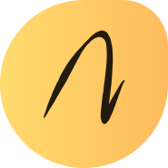

# Navaneethkumar — Portfolio Website

<div align="center">



**Solution Engineer · Siemens Ltd · Bengaluru, India**

[](https://navaneethkumar.github.io/Portfolio)
[](https://pages.github.com/)
[](https://developer.mozilla.org/en-US/docs/Web/HTML)
[](https://developer.mozilla.org/en-US/docs/Web/CSS)
[](https://developer.mozilla.org/en-US/docs/Web/JavaScript)

</div>

---

## 👤 About Me

I am **Navaneethkumar**, a dedicated **Solution Engineer at Siemens Ltd**, Bengaluru. I specialize in delivering innovative engineering solutions with a strong background in:

- **SCADA Graphics Design & Development** (WinCC, Desigo CC)
- **IoT & Industrial Internet of Things (IIoT)**
- **Digital Twins** using Autodesk Fusion 360
- **Building Management Systems (BMS) & Energy Management Systems (EMS)**
- **Robotics & Automation** using ROS2, RPA, and Microcontrollers
- **PLC Programming & Hardware Configuration** (SIMATIC S7, PROFINET, Modbus, OPC-UA)

My B.Tech in Robotics & Automation (Karunya Institute of Technology & Sciences) gives me the foundation to bridge technical knowledge with real-world industrial application.

---

## 🌐 Live Website

**🔗 [https://navaneethkumar.github.io/Portfolio](https://navaneethkumar.github.io/Portfolio)**

---

## ✨ Website Features

| Feature | Description |
|---|---|
| 🎨 **Custom Design** | Warm amber/charcoal editorial aesthetic — built from scratch |
| 🖥️ **Animated Canvas** | Live particle + grid background using HTML5 Canvas |
| 📱 **Fully Responsive** | Works on all screen sizes (mobile, tablet, desktop) |
| 🗂️ **5 Sections** | About · Resume · Portfolio · Blog · Contact |
| 🎠 **Sliders** | Testimonials slider with dots & arrows, Clients slider |
| 🔍 **Project Filter** | Filter portfolio by Robotics / Automation / Microcontrollers |
| 📊 **Skill Bars** | Animated progress bars triggered on scroll/navigation |
| 💬 **Testimonial Modal** | Click any testimonial card for a full-screen modal view |
| 🗺️ **Embedded Map** | Google Maps iframe showing Bengaluru location |
| 📬 **Contact Form** | Validated contact form with send button activation |
| ⚡ **Zero Dependencies** | Pure HTML, CSS, JavaScript — no frameworks, no build tools |

---

## 🗂️ Sections

### About
Introduction to my background, skills, and what I do. Includes a **stats bar** (Years of Experience, Projects, Clients, Domains), **4 service cards** (SCADA Design, SCADA Dev, Automation & Robotics, Digital Twin), testimonials from colleagues, and client logos.

### Resume
**Education timeline:**
- B.Tech Robotics & Automation — Karunya Institute of Technology & Sciences, Coimbatore (2021–2025)
- Diploma in Mechanical Engineering — NPA Centionery Polytechnic College, Kotagiri (2014–2017)
- Secondary Education — Govt. Higher Secondary School, Sholur (2014)

**Experience timeline:**
- Solution Engineer — Siemens Ltd (2025–Present)
- Application Engineer Intern (R&D) — Effica Automation (2024)
- QA Engineer (2017–2022)

**Skills:** PLC Programming (80%), SCADA Graphics (70%), Industrial Networking (90%), Cybersecurity & IIoT (50%), ROS2 & Robotics (75%), Fusion 360 (65%)

### Portfolio
9 projects across 3 categories:

| Project | Category |
|---|---|
| ACE — The Robot Dog | Robotics |
| Quadruped Bot | Robotics |
| Drone | Robotics |
| Sit-to-Stand Robot | Robotics |
| NPK Sensor | Automation |
| CSV Contacts → Salesforce | Automation |
| Cobot Automation with ROS2 | Automation |
| pH Sensor | Microcontrollers |
| Temperature & Humidity Sensor | Microcontrollers |

### Blog
6 articles on Quantum Computing, Robotics (ROS2), Autonomous Vehicles, Industrial Cybersecurity.

### Contact
Phone: +91 8098 727 895 | Location: Bengaluru, India | Embedded Bengaluru map | Contact form

---

## 📁 Project Structure

```
Portfolio/
│
├── index.html              # Main HTML file — all 5 pages
│
├── assets/
│   ├── css/
│   │   └── style.css       # All styles (2000+ lines, CSS variables)
│   │
│   ├── js/
│   │   └── app.js          # All JS (canvas, nav, sliders, filter, modal)
│   │
│   └── images/
│       ├── my-avatar.png   # Profile photo
│       ├── Project-01.webp # — Project-09.jpeg (project thumbnails)
│       ├── Blog-01.webp    # — Blog-06.png (blog images)
│       ├── Client-01.png   # — Client-13.png (client logos)
│       ├── avatar-1.png    # — avatar-4.png (testimonial avatars)
│       ├── icon-design.svg # Service icons
│       ├── icon-dev.svg
│       ├── icon-app.svg
│       ├── icon-photo.svg
│       └── logo.ico
│
└── README.md               # This file
```

---

## 🚀 Tech Stack

- **HTML5** — Semantic markup, single-page architecture
- **CSS3** — Custom properties, CSS Grid, Flexbox, animations, `@keyframes`
- **Vanilla JavaScript** — Canvas API, IntersectionObserver, touch events
- **Google Fonts** — Outfit + Nunito Sans
- **Ionicons 5** — Icon library (via CDN)
- **GitHub Pages** — Free hosting

---

## 🛠️ Local Development

```bash
# Clone the repository
git clone https://github.com/navaneethkumar/Portfolio.git

# Navigate into the project
cd Portfolio

# Open in browser (no build step needed)
open index.html
# or use VS Code Live Server extension
```

---

## 📬 Contact

| Channel | Details |
|---|---|
| 📞 Phone | [+91 8098 727 895](tel:+918098727895) |
| 📧 Email | [navaneethkumar@email.com](mailto:navaneethkumar@email.com) |
| 💼 LinkedIn | [linkedin.com/in/navaneethkumar](https://linkedin.com/in/navaneethkumar) |
| 🐙 GitHub | [github.com/navaneethkumar](https://github.com/navaneethkumar) |
| 🐦 Twitter | [@navaneethkumar](https://twitter.com/navaneethkumar) |
| 📍 Location | Bengaluru, Karnataka, India |

---

## 📄 License

This project is open source and available under the [MIT License](LICENSE).

---

<div align="center">
  <sub>Designed & built by Navaneethkumar · Solution Engineer · Siemens Ltd</sub>
</div>
